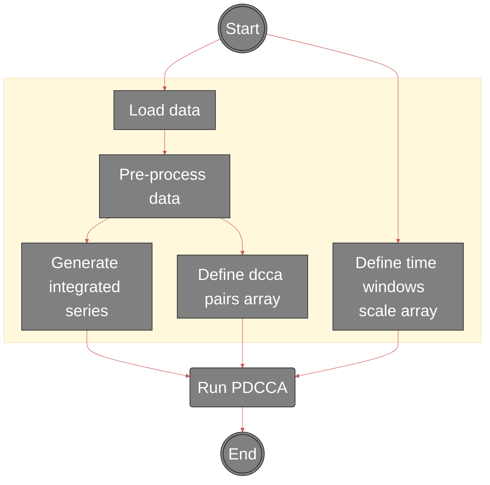
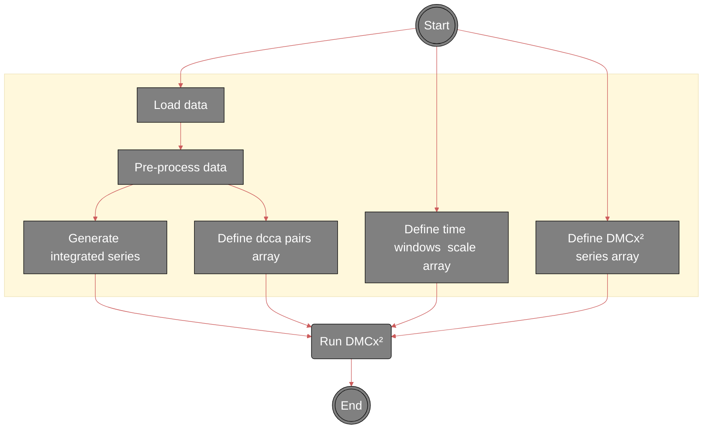
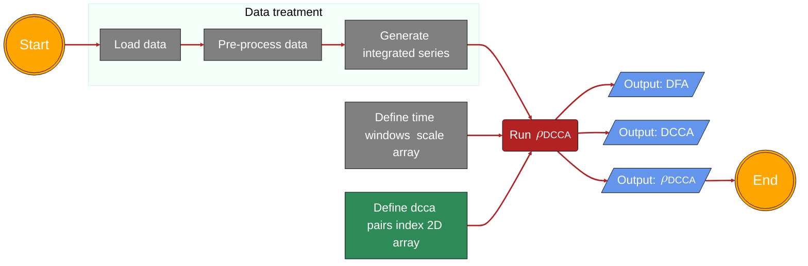
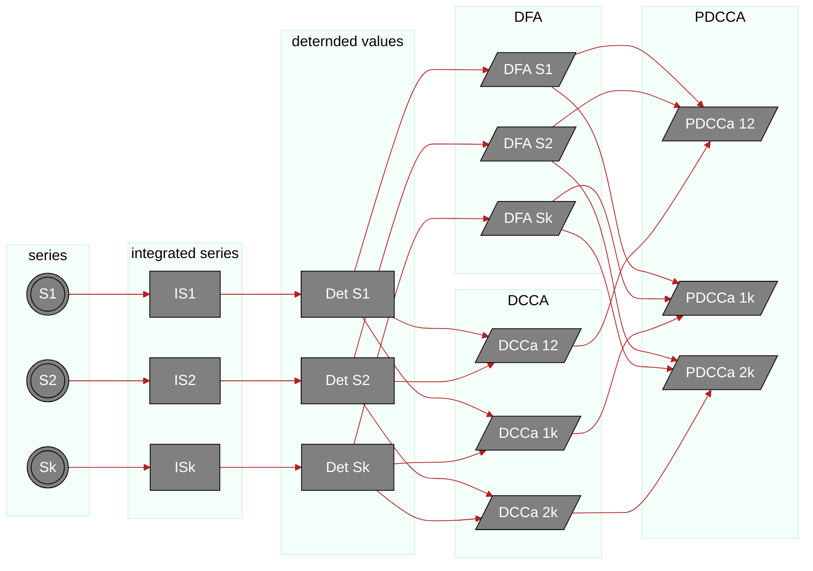

# Flowchart Diagrams

<!-- 

%%{
  init: {
    'theme': 'base',
    'themeVariables': {
      'primaryColor': '#BB2528',
      'primaryTextColor': '#fff',
      'primaryBorderColor': '#7C0000',
      'lineColor': '#F8B229',
      'secondaryColor': '#006100',
      'tertiaryColor': '#fff'
    }
  }
}%% 

-->

## PDCCA diagram

## DMCx² diagrams

## DMCx² chart

```mermaid
---
config:
  theme: base
  themeVariables:
    primaryColor: gray
    primaryTextColor: white
    primaryBorderColor: black
    lineColor: Black
    secondaryColor: blue
    tertiaryColor: LightGoldenRodYellow
    fontSize: 25px
  themeCSS: |
    .label {
      text-anchor: start; /* Align text to the left */
    }
    .edgePath path {
      stroke-width: 5px; /* Increase this value to get thicker arrows */
    }
    .edgeLabel {
      font-size: 12px; /* Adjust font size of edge labels if needed */
    }
---


flowchart LR

 subgraph dmc_func["Function: $$~DMC_x^2$$"]
ajust_pdcca_dmc

end
 subgraph data_treatment["Preparation"]
        data["Load data"]
        preproc["Pre-process data"]
        generate["Generate integrated series"]
 end

subgraph ajust_pdcca_dmc
  
    pdcca_func

  run_dmc("$$~~DMC_x^2$$")
  dmc_out[/"Output: $$~~DMC_x^2$$"/]
  dcca_pairs


end


 subgraph pdcca_func["Function:$$~\rho$$ <sub>DCCA</sub>"]

        det["Detrended values"]
        DFA["DFA"]
        dfa[/"Output: DFA"/]
        DCCA["DCCA"]
        dcca[/"Output: DCCA"/]
        p_dcca[/"Output: $$~~\rho$$ <sub>DCCA</sub>"/]
        P_DCCA["$$\rho$$ <sub>DCCA</sub>"]
 end

    Start((("Start"))) --> data
    data --> preproc
    preproc --> generate
    generate --> det
    define_tws["Define time windows scale array"] --> det
    dcca_pairs["Define dcca pairs index 2D array"] -->  DCCA & P_DCCA 
    det --> DFA & DCCA
    DFA --> dfa
    dfa --> P_DCCA
    DCCA --> dcca
    dcca --> P_DCCA
    P_DCCA --> p_dcca
    p_dcca --> run_dmc
    run_dmc --> dmc_out
    def_dmc["Define DMCx² series index 2D array"] --> run_dmc & dcca_pairs
    dmc_out --> end_chart((("End")))
    
%% class definitions
    classDef se_class fill:Orange, margin:120px, font-size:40px
    classDef pad_class margin-botton:1px
    classDef run_class fill:indianred, color:White
    classDef func_class fill:BurlyWood, color:White, margin:0px
    classDef func_dmc_class fill:PaleGoldenRod, color:black
    classDef optional_class fill:Seagreen, color:White
    classDef indirect_class fill:LightGrey, color:Black
    classDef out_class fill:CornflowerBlue
    classDef transparent_class fill:#00000000, color:#00000000, margin-top:200px

%% Class attribution
     dfa:::out_class
     dcca:::out_class
     P_DCCA:::pad_class
     p_dcca:::out_class
     Start:::se_class
     dcca_pairs:::indirect_class
     det:::indirect_class
     DFA:::indirect_class
     DCCA:::indirect_class
     P_DCCA:::indirect_class
     run_dmc:::run_class
     pdcca_func:::func_class
     dmc_out:::out_class
     def_dmc:::optional_class
     end_chart:::se_class
     dmc_func:::func_dmc_class
      ajust_pdcca_dmc:::transparent_class

```

## DMC chart

## estados

